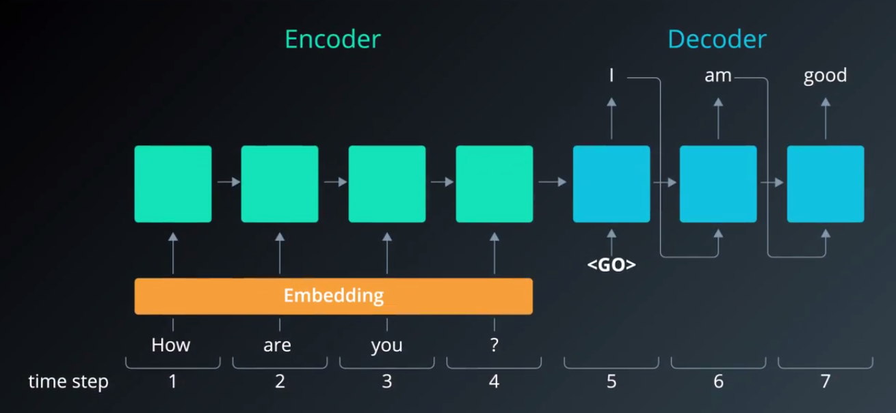
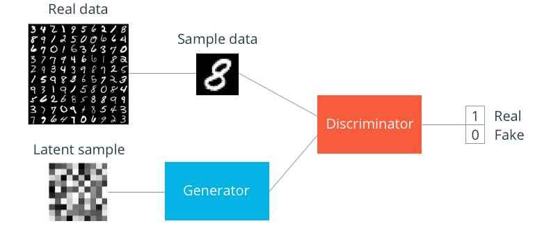

# 深度学习

## 第三周

1. 激活函数

S型函数的缺点：求导之后最大值只有0.25，error向前一层传播时会被减少太多当层数太多时近input层更新很慢，产生梯度消失问题。

ReLUs激活函数： $$ f(x) = max(0,x)$$ 优点训练速度快避免梯度消失，缺点步伐过大梯度过大会让后面的梯度全部变成0，死掉，减小步长有助于改善这个缺点。

2. 分类函数（新）

softmax函数：$\sigma(k) =\frac{e^k}{\sum ^K_1e^k} $    for $ k = 1,2,3....K $  可以同时判断出N个类别不像s型函数是二元的。

3. 分类中常用的另一种代价函数cross-entropy

   $$D(y,\widehat{y}) = -\sum_i ^ky_iln\widehat{y}_i... $$ 其中y是softmax函数算出的预测值，y-是真实值

   利用熵的算法去计算两个向量之间的相似程度，**注意：因为真实值大多是（1，0，0，0，1，0）这种所以上述方程的顺序不能颠倒。**

4. TFLearn

```python
net = tflearn.input_data([None,100]) ##input层 100是输入向量的维度
##hidden层 n_units是该层的单元个数，如果多层hidden可以重复使用这句语句
net = tflearn.fully_connected(net, n_units, activation='ReLU')
##设置如何训练网络 sgd随机梯度下降  loss 表示cost方程使用代价熵函数
net = tflern.regression(net,optimizer='sgd',learning_rate=0.1,loss='catagorical_crossentropy')
##创建模型实例
model = tflearn.DNN(net)
##训练模型 batch_size表示一次随机梯度下降使用多少条数据，n_epoch表示所有数据被训练几遍
model.fit(trainX,trainY,validation_set=0.1,show_metric=True,batch_size=100,n_epoch=20)
##预测结果
model.predict(testX)
```

## 第五周   卷积神经网络CNN 

1. [pickle](https://blog.oldj.net/2010/05/26/python-pickle/)包是用来把python对象持久化到一个文件的工具

2. 词频统计字典化 `dict(zip(*np.unique(labels, return_counts=True)))` [解释](http://www.cnblogs.com/BeginMan/archive/2013/03/14/2959447.html)

3. ​tensorflow的hello world

   ```python
   #import tensorflow as tf
   test = tf.constant("hello world!")
   with tf.Session() as sess:
   	output = sess.run(test)
       print(output)
   ```

4. cnn基本网络结构和处理步骤

   ```python
   # 把图片数据normalize
   # one-hot-encode label数据
   # 根据图片shape初始化输入参数名
   tf.placeholder(tf.float32,[None,32,32,3],name='x')
   # 逐层构建网络2-3个卷积max层  平滑层 dropout层 全链接层 output层
   weight = tf.Variable(tf.truncated_normal([conv_ksize[0], conv_ksize[1],a[3] , conv_num_outputs],std=0.01))
   bias = tf.Variable(tf.zeros(conv_num_outputs))    
   conv_layer = tf.nn.conv2d(x_tensor, weight, strides=[1, conv_strides[0], conv_strides[1], 1], padding='SAME')
   conv_layer = tf.nn.bias_add(conv_layer, bias)
   # Apply activation function
   conv_layer = tf.nn.relu(conv_layer) 
   poll_layer = tf.nn.max_pool(conv_layer,ksize=[1,pool_ksize[0],pool_ksize[1],1],strides=[1,pool_strides[0],pool_strides[1],1],padding='SAME')
   tf.contrib.layers.flatten(x_tensor)
   tf.nn.dropout(net, keep_prob)
   tf.contrib.layers.fully_connected(x_tensor,num_outputs,activation_fn=tf.nn.elu)
   # Loss and Optimizer
   cost = tf.reduce_mean(tf.nn.softmax_cross_entropy_with_logits(logits=logits, labels=y))
   optimizer = tf.train.AdamOptimizer().minimize(cost)

   # Accuracy
   correct_pred = tf.equal(tf.argmax(logits, 1), tf.argmax(y, 1))
   accuracy = tf.multiply(tf.reduce_mean(tf.cast(correct_pred, tf.float32)),100, name='accuracy')

   # 训练开始
   with tf.Session() as sess:
       # Initializing the variables
       sess.run(tf.global_variables_initializer())    
       session.run(optimizer, feed_dict={x: feature_batch, y:/ label_batch,keep_prob:keep_probability})
   ```

   5. dropout层用来主动丢失一些神经元间的连接，从而增加模型的鲁棒性。但是当模型没有验证集时，比如说词嵌入那么该层就没有太多存在的必要了。
   6. CNN虽然是只针对图像但是因为图像在计算机里本就是二维矩阵，所以我们可以拓展cnn的适用范围。把一个数据变成二维矩阵的形式之后那么所有cnn的东西就都可以套入了，这是一个**很好**的应用点。


## 第七周 循环神经网络RNN

1. 普通的RNN是把上一层的信息也作为输入带入到下一层，从而形成循环。但是因为每一层是共享参数，所以类似于

   ​                                        $$ y = w^n x $$

   这种当n过大时反向传播求导会出现梯度爆炸（w>1）或者梯度消失(w<1)的情况，会让训练变得困难。

2. LSTMs(Long Short Term Memory Networks 长短期记忆网络)是普通RNN的改进，它对于记忆cell层进行复杂的处理，可以自动选择前置的信息是遗忘还是记忆，从而解决梯度爆炸等问题。基本结构如下图:

   ​

3. LSTM主要有三个门来控制记忆，分别是遗忘门、输入门和输出门。遗忘门决定C层哪些信息需要被忘记，输入们决定新输入的信息哪些东西需要被添加到记忆C中，输出门决定哪些信息可以被输出到下一层h中去。

   - 第一步，对于输入信号$h_{t-1}$ 和$x_t$进行线性变换再通过一个S型函数输出一组（0，1）的值，0表示完全遗忘，1表示完全保留

     ​                              $$f_t = \sigma(w_{ft}(h_{t-1},x_t)+b_{ft}) $$

   - 第二步,将之前的记忆$C_{t-1}$的输入与之乘积，得到遗忘之后的信息

     ​                             $$C_{t-1} = C_{t-1} * f_t$$       

   - 第三步，将输入信息做一个S型函数变换（记忆门）与输入信号做一个$tanh$（将值压缩到-1，1之间的函数）变换的值相乘，决定那些新信息被添加到记忆中去

     ​                             $$i_t =  \sigma(w_{it}(h_{t-1},x_t)+b_{it})  $$

     ​                            $$p_t = tanh(w_{ct}(h_{t-1},x_t)+b_{ct}) $$

     ​                           $$i_t = i_t * p_t$$

   - 第四步，将新的记忆加到记忆层中去形成新的记忆层$c_t$输出到下一层

     ​                           $$C_t = C_{t-1}+i_t$$

   - 第五步，将新的记忆经过tanh变换再和输入信息整合生成新的h层信息进入下一层

     ​                               $$h_t = tanh(C_t) * f_t  \sigma(w_{ot}(h_{t-1},x_t)+b_{ot}) $$

   ##  

   ## 第八周 TensorBoard的使用

   ​

   1. graph可视化

      ```python
      with tf.Session() as sess:
          sess.run(tf.global_variables_initializer())
          #在graph run之后把图日志写入目录
      	file_writer = tf.summary.FileWriter('path/logs',sess.graph)
      // 之后就可以在命令行中直接调用该目录并显示可视化图
      tensorboard --logdir PATH
      ```

   2. 整理图——利用namescope

      ​	with tf.name_scope('input'):

      ​		inputs = tf.xxxxxxxx

      ​		x_one_hot = xxxxx

   3. 参数权重输出可视化

      ```python
      ##在日志中加入参数 
      tf.summary.scalar('cost',cost) #标量
      tf.summary.histogram('softmax_w',softmax_w) #矩阵向量

      ## 将所有要输出的merge到一起
      merged = tf.summary.merge_all()

      ##在模型run的时候添加summary输出
      summary,batch_loss,newstate = sess.run([model.merged,model.cost],feed_dict=feed)

      ## 并且在训练迭代时把参数summary添加到writer中去
      file_writer.add_summary(summary,iteration)
      ```

   4. 利用tb进行超参筛选并可视化

      ```python
      ## 要在train之前 也就是graph构建之前 循环配置超参 。每一组超参配置一个filewriter
      for lstm_size in [2,3,4]:
      	for learning_rate in [0.01,0.1]:
              log_string = 'logs/lstm={},lr={}'.format(lstm_size,learning_rate)
              file_writer = tf.summary.FileWriter(log_string)
              model = xx
              train(model)
      ```

   ## 第九周 seq2seq

   1. 构建rnn网络的时候 `tf.contrib.rnn.BasicLSTMCell(rnn_size)]` 是构建了一个rnn单元 其中rnn_size老师说是一个lstm单元里面元素的个数，看了源码觉得也可以这么理解rnn_size其实就是输出值的维度。它确定了一个imput通过cell之后output是一个几维向量

   2. tf.contrib.rnn.MultiRNNCell([tf.contrib.rnn.BasicLSTMCell(rnn_size)]*layer_size) 创建一个由多个RNNCells依次组成的RNN单元，其中

      layer_size表示纵向有多少层

   3. google翻译架构图 

      

   4. 翻译流程具体步骤

      + 构建input和target 也就是翻译的配对句子，但需要保证所有输入长度相同。所以不足的用特殊标记补足。
      + 对于input做embed后作为真正的input输入到encoder模块中去
      + encoder是一个rnn的序列模型，它最后会把input编码为一个final_stat的向量。也就是普通的rnn序列我们只取最后一个单元的隐藏层的stat值（在改进的attention模型中会用到每一个cell的output的值，来获取更多的信息）。因为rnn中的记忆门和遗忘门的存在，我们认为final_stat就是一个包含了整句话信息的编码了。也就是一个多维向量。
      + decoder模块是另一个rnn序列模型，它接受encoder层传来的final_stat作为一个输入维度。然后会分为两个部分：训练和推理。这两个部分共享参数。
      + 训练时为了避免仅使用final_stat差距过大，会在input同时给出正确的翻译词语，然后每个output的目标就是正确的翻译词语的后一个字 <start> i love you =====> i love you <end>这样。
      + 训练完成后，真正机器翻译时就在已训练好的模型上只接收final_stat作为输入，然后起始词<GO>作为第一个输入，获得output后再将output获得的词语作为输入不断重复，直到得到终止词<EOS>
      + decoder的每一个cell输出是一个rnn_size维的向量 需要通过被翻译语言的embed矩阵转化为词典个数维度的向量，然后通过一个softmax层，来把正确翻译应该获得的那个词让它对应位置的数字最大。

   ## 第十周 生成对抗网络

   1. 随机梯度下降优化算法有时候会比全梯度下降算好表现好。是因为随机梯度下降波动性比较大，具有一定的随机性所以反而更有可能冲过一些局部最优点。

   2. 在对抗学习时经常会对每一层都使用数据正规化,而且如果使用了这个在tf.run的时候需要做特殊的处理，可能是为了保存参数

      >  Batch normalization is a technique for improving the performance and stability of neural networks. The idea is to normalize the layer inputs such that they have a mean of zero and variance of one, much like how we standardize the inputs to networks.

   3. 对于超参batch_num的选择并不是只要内存足够越大越好。因为和1. 相关比较小的batch会有一定的随机性比较容易跳出局部最优化，而batch如果太大，可能没有这么好。

   4. GAN需要同时训练两个网络一个是Generator是真正最后用来生成假数据的，另一个是Discriminator是传统的分类网络用来训练判断数据真假的。D需要尽可能准确的判断出哪些是真正的数据哪些是G生成的假数据，而G要尽可能多的提升自己造假的能力，让D无法区分出真假。最后两者在博弈论的平衡下达到纳什均衡。

      

   5. 首先有一个传统的分类网络D，我们喂给他的真实数据标记为1，其他数据标记为0。G需要通过一个随机噪声向量通过自身网络生成一个和真数据一样大小的数据。先不变G的参数，训练D，让区分度最大，再不变D的参数训练G让G被标记为1的概率最大。也就是一个maxmin game。最后达到一个均衡后，抛弃D，那么G就是我们要的GAN了。

   6. 代价函数 
      $$
      d\_loss = d\_loss\_real + d\_loss\_fake                                
                               
      $$
      ​
      $$
      g\_loss = d\_loss\_fake\_fake\_to\_real
      $$

   7. 感觉GAN的训练非常困难，对于许多传统DP不需要处理的地方都需要做特殊处理比如leaky ReLU还有real_lable smooth等等。另外还有一个未解决的问题是如果真实的数据有多个部分，那么一般训练出来的G可能只有一个部分，而且即使你不断迭代它也只会在部分之间切换，而学不到把它们组合起来。

   8. `tf.nn.sigmoid_cross_entropy_with_logits`该函数在计算cost时需要的参数是做sigmoid处理之前的，也就是该函数内部会自己对输入的数据进行sigmoid，并计算cost。这么做的目的是联合到一起做会有一些内部计算的优化，可以让数据计算更准确。[参考](http://freemind.pluskid.org/machine-learning/softmax-vs-softmax-loss-numerical-stability/)

   9. 在G模型中存在一个将tensor由小而粗的形状扩大到大而窄直到3层通道普通图片的情况。这时候我们可以使用卷积方法

      > tf.layers.conv2d_transpose

      但是如果这样很容易会产生[棋盘问题](http://distill.pub/2016/deconv-checkerboard/) 。可以使用`tf.image.resize_images()`来扩大图片，之后再用普通卷积层处理。测试下来理论上只要关注维度是正确的就可以，但是实际感觉效果并没有什么变化。


   ​
